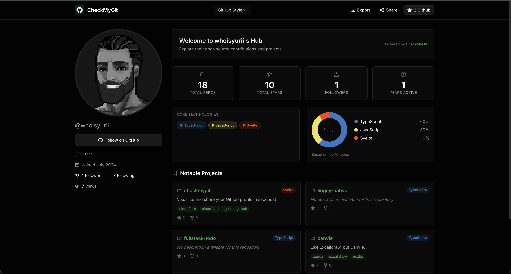

<h1 align="center">CheckMyGit</h1>

  <strong>Transform any GitHub profile into a stunning portfolio in seconds.</strong>

  <a href="https://checkmygit.com">Live Demo</a> •
  <a href="#features">Features</a> •
  <a href="#tech-stack">Tech Stack</a> •
  <a href="#roadmap">Roadmap</a>

---

  

---

## Features

- **Instant Generation** — Enter any GitHub username, get a beautiful portfolio
- **3 Templates** — GitHub-style sidebar, Bento grid, or Minimal CV layout
- **Contribution Graph** — Full year heatmap visualization
- **Language Stats** — Donut chart breakdown of your tech stack
- **Pinned Projects** — Showcase your best repositories
- **PNG Export** — Download your portfolio as an image
- **Shareable URLs** — `checkmygit.com/username?template=bento`
- **No Auth Required** — Fully open source, no sign-up needed

## Tech Stack

- **Framework:** SvelteKit 2 + Svelte 5 Runes
- **Styling:** Tailwind CSS 4
- **API:** GitHub GraphQL + REST fallback
- **Deployment:** Cloudflare Pages
- **Export:** html-to-image

## Roadmap

- [ ] **Dynamic OG Images** — Satori + Resvg for custom social preview cards
- [ ] **New Templates** — Developer card, Resume/CV, Portfolio grid
- [ ] **UI Polish** — Dark/light theme toggle, animation refinements
- [ ] **PDF Export** — Download portfolio as PDF document
- [ ] **Custom Themes** — User-defined accent colors and fonts

## Contributing

Contributions welcome! Feel free to open issues or submit PRs.

## License

MIT

---

  Built with SvelteKit & shipped on Cloudflare

